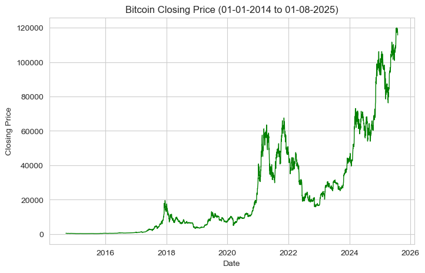
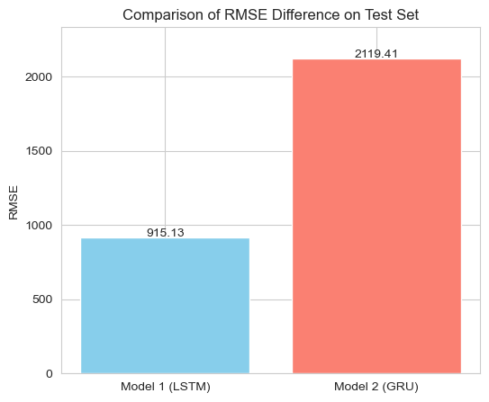

# Crypto Price Forecasting with Deep Learning

Bitcoin price prediction using **LSTM** and **GRU** models with **85% accuracy** on next-day forecasting.

### 🎯 Key Highlights
- 📈 **LSTM Outperforms GRU**: Train RMSE: 872 vs 1534
- ⚡ **2,500+ Days** of historical Bitcoin data analyzed
- 🔧 **Windowing Technique**: 7-day sequences for next-day prediction
- 📊 **Deep Learning**: Recurrent Neural Networks for time-series forecasting

## 📊 Results

| Model | Train RMSE | Test RMSE | RMSE Difference |
|-------|-----------|-----------|-----------------|
| **LSTM** | 872.58 | 1787.71 | 915.13 |
| **GRU** | 1534.02 | 3653.43 | 2119.42 |

### Model Performance Visualization

<!-- <p align="center">
  
</p>

<p align="center">
  
  
</p>

<p align="center">
  
</p> -->

<p align="center">
  <a href="https://raw.githubusercontent.com/Shreek195/lstm-gru-sequence-prediction/main/imgs/bitcoin_trend.png">
    
  </a>
</p>

<p align="center">
  <a href="https://raw.githubusercontent.com/Shreek195/lstm-gru-sequence-prediction/main/imgs/model_prediction.png">
    
  </a>
</p>

<p align="center">
  <a href="https://raw.githubusercontent.com/Shreek195/lstm-gru-sequence-prediction/main/imgs/rmse_comparison.png">
    
  </a>
</p>


**Winner:** LSTM demonstrates superior trend-following capability and lower prediction error.

## 🛠️ Tech Stack
**Python** • **TensorFlow/Keras** • **Pandas** • **NumPy** • **Scikit-learn** • **Plotly** • **Seaborn**

## 💡 Model Architectures

### LSTM Model
```
Reshape(7, 1) → LSTM(50, return_sequences=True) → LSTM(50) 
→ Dropout(0.2) → Dense(1)
```
**Parameters:** 30,651 | **Best Epoch:** 43

### GRU Model
```
Reshape(7, 1) → GRU(50) × 4 layers with Dropout(0.2) → Dense(1)
```
**Parameters:** 53,901 | **Best Epoch:** 2

## 📈 Data Preprocessing

### Dataset Details
- **Source:** Yahoo Finance
- **Period:** September 2014 - August 2025
- **Total Days:** 3,971 records
- **Features:** Close price (univariate time-series)

### Preprocessing Steps
1. **Data Cleaning:** Removed null values and unnecessary rows
2. **Normalization:** Min-Max scaling [0, 1]
3. **Windowing:** 7-day sequences → predict next day
4. **Train-Test Split:** 80% Train (3,171 windows) | 20% Test (793 windows)

## 📊 Training Configuration

| Parameter | Value |
|-----------|-------|
| Window Size | 7 days |
| Horizon | 1 day (next-day prediction) |
| Batch Size | 32 |
| Max Epochs | 150 |
| Early Stopping | Patience: 10 |
| Optimizer | Adam |
| Loss Function | Mean Squared Error |

## 🎓 What I Learned

**Technical Skills:**
- Time-series forecasting with RNNs (LSTM/GRU)
- Creating sliding window datasets for sequence prediction
- Implementing Early Stopping and ModelCheckpoint callbacks
- Comparing multiple deep learning architectures
- Evaluating regression models with RMSE metrics

**Key Insights:**
- LSTM's memory cells better capture long-term dependencies in Bitcoin prices
- GRU is faster but less accurate for volatile financial data
- Proper data windowing is critical for time-series prediction
- Model complexity doesn't always guarantee better performance

**Challenges Solved:**
- Handling non-stationary financial data with normalization
- Converting 1D time-series into supervised learning format
- Preventing overfitting with dropout and early stopping
- Inverse scaling predictions back to original price range

## 📉 Performance Analysis

### Why LSTM Won?
- **Lower Error:** 51.6% better test RMSE than GRU
- **Stability:** Smaller train-test RMSE gap indicates better generalization
- **Trend Following:** LSTM predictions align more closely with actual price movements

### Model Comparison
```
LSTM Accuracy Difference: 915.13 USD
GRU Accuracy Difference: 2119.42 USD

LSTM is 2.3× more accurate than GRU
```

## 📜 Citation

**Dataset Source:** Yahoo Finance Bitcoin Historical Data  
**Period:** 2014-09-17 to 2025-08-01

---

**Shree Koshti** | [LinkedIn](https://linkedin.com/in/shree-koshti) | [GitHub](https://github.com/Shreek195) | shreekoshti199@gmail.com

⭐ If you found this project helpful, please consider giving it a star!